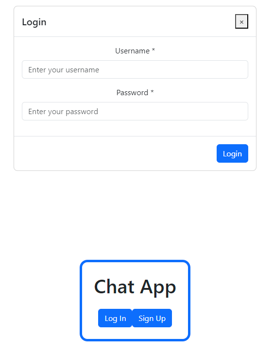
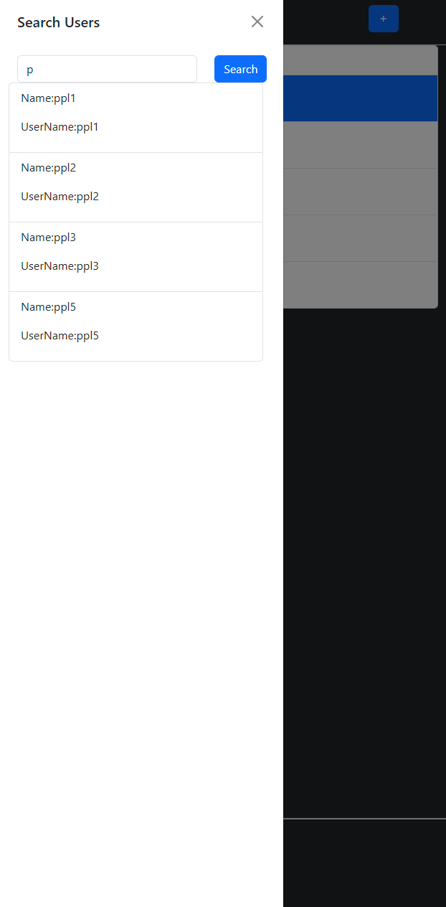
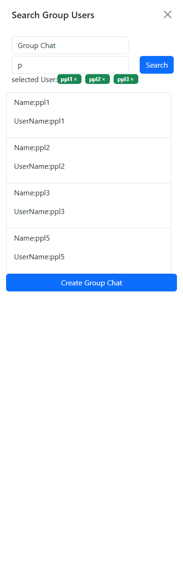
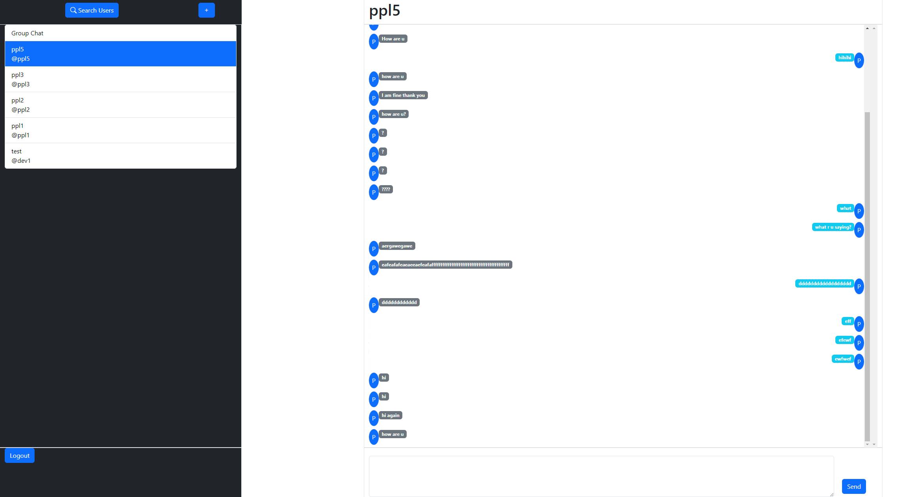

# MERN Stack Chat App

## Description

A powerful and feature-rich chat application built using the MERN (MongoDB, Express.js, React, Node.js) stack. This application is designed to provide users with a seamless and real-time communication experience in a user-friendly environment.

## Table of Contents

1. Demo
2. Installation
3. Key Features
4. Technologies Used
5. License

## Demo

**Chat App Login Page**



**Chat App Login Page**



**Chat App Interface**



**Chat App Interface**



## Installation

1. **Install server dependencies:**

   ```bash
   cd server
   npm install
   ```

   <br />

2. **Install client dependencies:**

   ```bash
    cd server
    npm install
   ```

    <br />

3. **Configure environment variables:**

   Create a `.env` file in the server directory and set the following variables:

   ```env
   PORT=5000
   MONGODB_URI=your_mongodb_connection_string
   JWT_SECRETKEY=your_prefer_Web_Tokens
   ```

   <br />

4. **Start the server and client:**

   In separate terminal windows, run the following commands:

   ```bash
   # Start the server
   cd .\backend\
   npm start
   ```

   ```bash
   # Start the client
   cd .\frontend\
   npm run dev
   ```

   <br />

5. **Visit `http://localhost:####` in your browser.**

## Key Features

- Real-time Messaging: Enjoy instant communication with other users through the magic of Socket.io, ensuring that your messages are delivered and received in real-time.

- User Authentication: Your security is our priority. Employs JWT (JSON Web Tokens) for secure and reliable user authentication, giving you peace of mind while using the app.

- MongoDB Database: All your chat data is securely stored in MongoDB, providing a scalable and efficient solution for managing conversations and user information.

- React rontend: The frontend is built with React with Bootstrap frontend toolkit, offering a responsive and dynamic user interface. Navigate effortlessly through the app and enjoy a smooth chatting experience.

- Easy Istallation: Getting started is a breeze with our straightforward installation process. Follow the simple steps in the Installation section of the README to have chat app up and running in no time.

## Technologies Used

**Frontend:**

- React
- Boostrap

**Backend:**

- Node.js
- Express.js

**Database:**

- MongoDB

**Others**

- Web Socket

## License

This project is licensed under the terms of the https://github.com/piyush-eon (https://github.com/piyush-eon/mern-chat-app)<br />
Please refer to the original project's license for details. By contributing to this project, you agree that your contributions will be subject to the terms of the original license.
